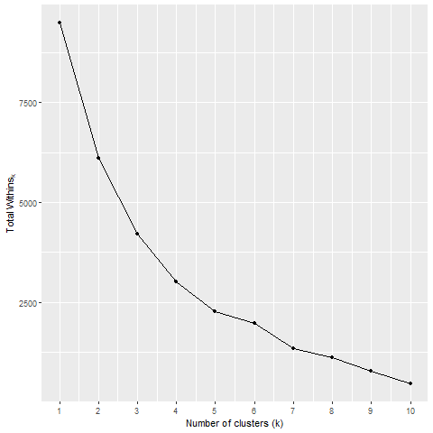
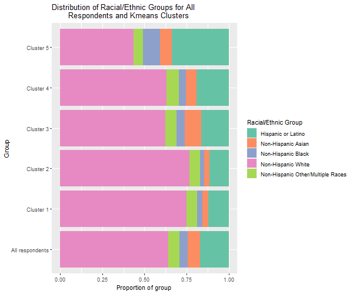
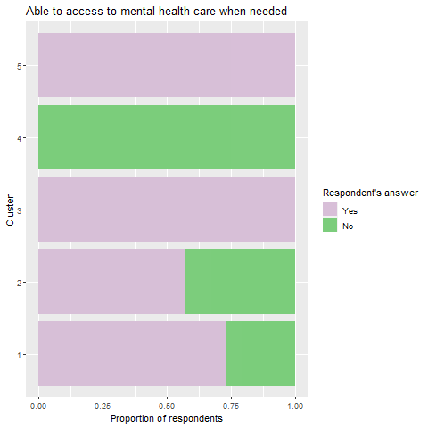

```{r setup, include = FALSE}
library(tidyverse)
library(knitr)

# Set code chunk defaults 
knitr::opts_chunk$set(echo = FALSE, 
                      mesage = FALSE,
                      warning = FALSE,
                      fig.align = "center")

# Set R environment options
options(knitr.kable.NA = '')
```

# Introduction

```{r covid, out.width="80%"}
knitr::include_graphics("images_and_plots/coronavirus_intro.png")
```


The COVID-19 pandemic has had an enormous impact on Americans' lives on so many dimensions and levels, from the nationwide level to the state level, all the way down to the individual level. We were thus interested in exploring different COVID-related relationships using networks, unsupervised clustering, text analysis, and geo-spatial data, given the vast possibility of analyses that could shed more insight into how COVID has affected America. We firstly created an interactive network to explore how related different states were in terms of sharing the same COVID restrictions. Secondly, we created an interactive map to explore how different local news headlines changed in terms of content and sentiment as the pandemic went on. Thirdly, we used unsupervised clustering to determine if mental healthcare access and healthcare coverage was patterned by racial/ethnic groups. Lastly, we created an interactive network to explore how related different racial/ethnic groups were in terms of sharing the same mental health-related attributes.

# COVID State Restrictions Network {#restrictions-network}

We wanted to explore how different states are connected by how many days in 2020 they shared the same COVID restrictions (restaurant restrictions, bar restrictions, mask mandates, gathering bans, and stay at home orders). Hence, we were interested in creating a network, with each node representing a state and each edge connecting two states together. The nodes are colored by the proportion of annual COVID cases per state population, and the edges are weighted by how many days each pair of states shared the same restrictions in 2020. Users can also select the exact states to visualize (we recommend looking at five states or less; otherwise the network becomes too crowded!), as well as the type of COVID restriction to explore. There is a drop-down menu for states above the network; when a state is selected, its edges with other states will be highlighted so they can be more easily seen. Lastly, users can hover over the edges in the network to see the exact number of days that each pair of states shared.

Explore and interact with the COVID state restrictions network below, or alternatively, visit [our Shiny app](https://th23.shinyapps.io/state_restrictions_network_shiny/) to interact with the network in a browser!

```{r, out.extra="data-external=1"}
knitr::include_app("https://th23.shinyapps.io/state_restrictions_network_shiny/", 
                   height = "1500px")
```

## Data {.tabset .tabset-fade .tabset-pills}

### Data Sources

For the COVID state restrictions network, we used data from the Centers for Disease Control and Prevention (CDC) on state-issued prevention measures for COVID-19. The specific data-sets we used were:

* `Restaurants.csv`, which contains U.S. state and territorial orders closing and reopening restaurants issued from March 15, 2020 through August 15, 2021 by county by day

* `Bars.csv`, which contains U.S. state and territorial orders closing and reopening bars issued from March 15, 2020 through August 15, 2021 by county by day

* `Mask_Mandates.csv`, which contains U.S. state and territorial public mask mandates from April 10, 2020 through August 15, 2021 by county by day

* `Gathering_Bans.csv`, which contains U.S. state and territorial gathering bans from March 11, 2020 through August 15, 2021 by county by day

* `Stay-At-Home_Orders.csv`, which contains U.S. state and territorial public mask mandates from March 15, 2020 through August 15, 2021 by county by day

Visit [the CDC website](https://data.cdc.gov/browse?category=Policy+Surveillance) to explore and download the data-sets. 

### Data Wrangling {#restrictions-wrangling}

_The following code chunks were for wrangling the `Restaurants.csv` data set, but the exact same procedure was repeated with the other four data sets._ 

In order to build a network diagram using the `igraph` package in R, we needed to transform the raw data into an edge list, a data frame where there are three columns; the first column would contain the origin states, the second column would contain the target states, and the third column would contain the number of days the states in the first and second column share. After getting all five raw data sets into this format, we converted them into an `igraph` object using the `graph_from_data_frame` function in the `igraph` package. We also specified that it was an un-directed network by putting FALSE in the `directed` argument, since it did not matter which direction the edges went between each pair of states.

We then wanted to use the `visNetwork` package to create interactive network visualizations. We converted the `igraph` objects into a format usable for `visNetwork` using the `toVisNetworkData` function. 

```{r echo=TRUE, eval = FALSE}
# Create an igraph object
restaurants_igraph <- graph_from_data_frame(restaurants_final, directed = FALSE)

# Convert igraph to visNetwork format
restaurants_visNetwork <- toVisNetworkData(restaurants_igraph)
```

The `visNetwork` package requires the edges in the network to be a data frame. The original edges data frame in the `visNetwork` object contained three columns: a "from" column and a "to" column that taken together, contained all possible combinations of two states, as well as a column for the number of days each pair of states shared. However, `visNetwork` allows us to add properties to edges by simply adding columns to the data frame. We thus added a column for edge width and edge labels using the `mutate` function from `dplyr`.

```{r echo=TRUE, eval=FALSE}
# Wrangle edges data
restaurants_edges <- restaurants_visNetwork$edges %>%
  # Create a new column for edge width
  mutate(value = as.numeric(restaurants_overLap),
         width = value/100) %>%
  select(-value) 

restaurants_edges <- restaurants_edges %>%
  # Create a new column for edge labels that appear when hovered over
  mutate(title = paste0(restaurants_edges$restaurants_overLap, " days shared in 2020"))
```

Similarly, the `visNetwork` package requires the nodes in the network to be a data frame. The original nodes data frame in the `visNetwork` object originally contained two columns, an "id" column and a "label" column that contained the state names for the nodes. However, we also added a new column for the color of each node, where color corresponded to the proportion of annual COVID cases per state population. The `eigScalePal` function creates a gradient of five colors from the `colorRampPalette` function, and the `mutate` command breaks the COVID cases proportions column values into five sections, assigning each value to one out of the five colors.

```{r echo=TRUE, eval=FALSE}
# Set color palette
eigScalePal <- colorRampPalette(c("blue", "red"), bias = 5)
num_colors <- 5

# Wrangle nodes data
restaurants_nodes <- restaurants_visNetwork$nodes %>%
  # Join annual cases dataset
  inner_join(annual_cases, by = c("id" = "state")) %>%
  # Create a new column for node color, colored by annual COVID cases in relation to color palette legend
  mutate(color = eigScalePal(num_colors)[cut(covid_prop, breaks = num_colors)]) %>%
  select(-c(covid_prop))
```

## Creating the Interactive Network in Shiny {#visnetwork-shiny}

In order to create an interactive network in a Shiny app, the function, `visNetwork()`, can be used within the `renderVisNetwork()` function in the Shiny server code. The `visNetwork()` function needs two arguments: the nodes and the edges. Using the pipe function, there are also many other functions that can be used to further customize the network. For example, the `visOptions()` function allows users to select a node and have its connecting edges highlighted. Another example is the `visEdges()` function that specifies the color of the edges and the different color they should change to when selected. 

To be able to add and remove nodes interactively, depending on what the user selects, an updated network can be created using the `visNetworkProxy()` function. After creating data frames to contain the nodes that the user selected and did not select, `visRemoveNodes()` and `visUpdateNodes()` can be used to reactively display only the nodes the user selected in the network.

```{r echo=TRUE, eval=FALSE}
server <- function(input, output) {
  
  output$network_proxy_update <- renderVisNetwork({
    visNetwork(active_nodes(), active_edges(), height = "700px", width = "100%", 
               # Create a title for network
               main = list(text = "Network for States Sharing the Same COVID Restrictions in 2020", 
                           style = "font-family:Arial;font-size:20px"
               )) %>%
      # Specify size of nodes
      visNodes(size = 10) %>%
      # Allow users to select a node and have its edges highlighted
      visOptions(selectedBy = "group", 
                 highlightNearest = list(enabled = TRUE, hover = TRUE), 
                 nodesIdSelection = TRUE) %>%
      visPhysics(stabilization = FALSE) %>%
      # Specify color of edges
      visEdges(color = list(color = "black", highlight = "red")) 
  })
  
  myVisNetworkProxy <- visNetworkProxy("network_proxy_update")
  
  observe ({
    # Create a data frame to contain the nodes the user selects
    filteredNodes <- active_nodes()[gathering_ban_nodes$id %in% input$filterNodes, ,drop = FALSE]
    # Create a data frame to contain all the nodes the user did not select
    hiddenNodes <- anti_join(active_nodes(), filteredNodes)
    visRemoveNodes(myVisNetworkProxy, id = hiddenNodes$id)
    visUpdateNodes(myVisNetworkProxy, nodes = filteredNodes)
  })
}
```

## Findings 

Overall, the network allows users to explore the relationships between different states of their choice in terms of how many days in 2020 they shared the same COVID restrictions, as well as specify which COVID restriction they wanted to look at. There are many different analyses that can come from exploring the network, but it's interesting to see that there is not one dominant pattern or takeaway. Some states with radically different annual COVID cases per population share the same state restrictions for the majority of 2020, whereas some states with very similar annual COVID cases per population share very little of the same state restrictions in 2020. This underlies the complexity of COVID severity in states, and it's important to remember that state restrictions are only one factor within many that influence the proportion of COVID cases that emerge in different locations.

## Limitations and Future Research

The limitations of the network were that the edges were difficult to meaningfully differentiate by edge width alone, thus necessitating the addition of edge labels that users can hover over to see the exact number of days that states shared the same restrictions in 2020. Furthermore, since each state shared at least one day of COVID restrictions with all the other states for all five types of restrictions, the network becomes crowded very quickly when more nodes are added. If there was a cutoff number of days that we decided on, then it would be enable users to see which states had more connections, like in most networks where not every node connects to every other node. We would also be able to use the `cluster_fast_greedy()` function to identify and color communities, sections of the network where are more connections within that section than there are between that section and other sections of the network. For future research, it would be interesting to look at networks of different counties within states to see how many days they shared the same COVID restrictions within 2020, as well as see whether there are meaningful differences between states in terms of sharing the same COVID state restrictions in 2021 compared to 2020.

# Word Map 

```{r load-data, echo = FALSE, include=FALSE}
headlines_ex <- read_csv("data/news/headlines.csv", n_max = 5)
```

To further understand how the COVID-19 pandemic affected Americans, we have performed textual analysis. Text has the potential to be revealing in an entirely different way from the results of the Household Pulse survey, since language allows for the expression of nuance and feelings and emotions in a way that something so rigid as a census survey cannot. We wanted to go local, so we took news headlines from all fifty states and explored the trends and connections hidden within them. Our main tools in this endeavor were a word frequency analysis and a sentiment analysis, both of which use data that represent a much more colloquial and social view of how the pandemic was digested and affecting Americans than the purely categorical and standardized data that we studied in our first project, which centered around the Household Pulse Survey Data.

View our findings and explore further with our [Text Analysis Shiny App!](https://hbassett23.shinyapps.io/blog_text-analysis/)

## Data {.tabset .tabset-fade .tabset-pills}

### Data Sources

The data for the text analysis portion of the project was scraped from local news sites from all fifty states. We found the most widely circulated news outlet in each state (according to [this media source](https://www.agilitypr.com/resources/top-media-outlets/)). At first, we attempted to scrape each news site individually, but this proved very challenging because each site was built differently, so this effort would have required fifty different individualized scraping scripts, which was not feasible. We turned to [Google News](https://news.google.com) as our solution; using this site, we can easily search individual news sites and get back results in a standardized manner.

We were chiefly interested in the sentiments and discussions revolving around the COVID-19 pandemic, so we only searched for articles that included the keyword **"covid"**. Additionally, we restricted each search to time frames that matched up with the time frames that we used in our originally analysis, with the Household Pulse Survey data.

We ran into some issues at first, since Google does not allow scraping of Google News' search results page, which would have been a relatively easy way to obtain headlines. We were able to obtain RSS feeds of Google News searches: these are outputs in XML format that are typically used for email feeds and the like. There was no explicit restriction against scraping these feeds, so we used this output along with the `tidyRSS` package to obtain certain parts of the feed---specifically, headlines. (We were also somewhat ethically assuaged by the fact that each individual news website had no issue with scraping their headlines.)

The specifics of scraping involved nested `for` loops: we had to scrape news sites from fifty states (taken care of by the outer loop), and for each state, we had to scrape headlines for each of the eighteen "weeks" that we were interested in (the inner loop).

```{r scraping-code, echo = TRUE, eval = FALSE}
# Loop for 50 states
for (i in 1:50) {
  
  # Set current state
  state <- news_sites$state[i]
  #Set current news url
  site <- news_sites$url[i]
  
  # Loop for 18 weeks
  for(j in 1:18){
    
    # Set current start date (of time period in question)
    start_date <- weeks$start[j]
    # Set current end date (of time period in question)
    end_date <- weeks$end[j]
    
    # Create Google News RSS url to scrape
    rss_url <- paste0("https://news.google.com/rss/search?q=before%3A", end_date, "%20after%3A", start_date, "%20covid%20", state, "%20site%3A", site, "&hl=en-US&gl=US&ceid=US%3Aen")
    
    # Scrape data from RSS feed
    headlines_scraped <- tryCatch(
      
      # Return NA instead of headline text when error is thrown (usually because there are no articles that meet criteria)
      error = function(cnd) {
        return(NA)
      },
      
      # Otherwise, pull headline text from the RSS feed
      scraped_text <- rss_url %>% 
        tidyfeed() %>% 
        select(item_title)
    )
    
    # Add scraped headline into our pre-made list
    headlines$headline_text[(i-1)*18 + j] <- headlines_scraped
    
  }
}
```

Once the scraping was completed, we had an (enormous) .csv file with an observation for every headline scraped, tagged with the state of the news outlet that it came from and the week that the headlines ran.

```{r example-headlines, echo = FALSE}
head(headlines_ex)
```

### Data Wrangling

Once we obtained the raw text of every COVID-related headline from Week 22 to Week 39, we began performing text analysis on these headlines. The first wrangling was a simple word frequency analysis, breaking the headlines up and then tallying how often each one appeared (still separated by state and by week, so the tallies were specific to a certain location and time period, i.e. how many times the word **vaccine** appeared in headlines from Massachusetts during Week 33).

```{r freq-analysis, echo = TRUE, eval = FALSE}
word_frequencies <- all_headlines %>% 
  # Break headlines up into unigrams
  unnest_tokens(output = word, input = headline_text, drop = TRUE) %>% 
  # Remove typical stop words
  anti_join(stop_words, by = "word") %>% 
  # Add word frequencies
  add_count(state, week, word) %>% 
  # Remove duplicate entries
  distinct() %>% 
  # Group words by state & week, then sort by frequency
  arrange(state, week, desc(n))
```

We then did some custom filtering of the unigrams that we ended up with: we had already filtered out the typical stop words from the built-in dictionary, but looking through the data, it was clear that there were some more words that would not be useful to any of our analysis. For example, the names of the newspapers frequently showed up in the headlines that we scraped (i.e. "Massachusetts COVID-19 Cases Spiking Once Again -- Boston Globe"), and clearly if they were in every headline, then they would clog up our frequency analysis. We therefore removed any newspaper-related and any location-specific words from the raw text, as well as any "textual detritus, such as urls or numbers:

```{r custom-filtering, echo = TRUE, eval = FALSE}
words_wrangled <- word_frequencies %>% 
         # Filter out any numbers
  filter(!str_detect(word, "[:digit:]"),
         # Filter out any phrase with "." (mostly urls)
         !str_detect(word, "\\."),
         # Filter out "covid"
         !str_detect(word, "covid"),
         # Filter out the state names
         !str_detect(word, tolower(as.character(word_frequencies$state)))) %>%
  # Remove custom stop words
  anti_join(custom_stops, by = "word")
```

With that, our text was wrangled, and we were ready for our final analysis.

## Creating Interactive Word Maps in Shiny {.tabset .tabset-fade .tabset-pills}

### Creating the Shiny app

Our interactive analysis consists of two parts: a word frequency map that explores *qualitatively* how different states were discussing, reporting, contextualizing, and focusing on the pandemic; and a sentiment analysis map, that explores *quantitatively* how different locations in the United States viewed the pandemic. We combined both of these elements into a Shiny app:

```{r text-shiny}

# Henry's shiny app will go here when he gets around to publishing it

```

Pulling the most frequently used words from each state required more wrangling, but it needed to be contained within the Shiny app, since it demanded *reactivity* since the words displayed depended on user input, both for the week in question and the number of words that the user wanted displayed:

```{r wordmap-reactive-wrangling, echo = TRUE, eval = FALSE}
# Perform reactive wrangling for word frequency map
  wordmap_words <- reactive({
    
    words_wrangled %>%
    # Filter only weeks specified by slider
    filter(week == input$week_slider1) %>% 
    # Arrange words first by state, and then by how often they occur  
    arrange(state, desc(n)) %>% 
    # Create a list-column of words & frequency for each state  
    nest(word_list = c(word, n)) %>%
           # Make state names lowercase  
    mutate(state = tolower(state),
           # Pull out the top however-so-many words from each state
           reactive_words = map(word_list, ~
                                    .x %>% 
                                    select(word) %>% 
                                    slice_head(n = input$words_slider1) %>% 
                                    pull(word))) %>%
    # Add mapping sf data to text data  
    right_join(state_map, by = c("state" = "ID")) %>% 
    # Coerce back into sf object
    st_as_sf()
    
  })
```

The sentiment analysis required a similar amount of reactive wrangling; this time, the focus was on finding the weighted mean sentiment for each state given the time frame of interest:

```{r sentiment-reactive-wrangling, echo = TRUE, eval = FALSE}
# Perform reactive wrangling for sentiment analysis map
  sent_words <- reactive({
    
    words_wrangled %>% 
    # Filter only weeks specified  
    filter(week == input$week_slider2) %>% 
    # Arrange words first by state, and then by how often they occur
    arrange(state, desc(n)) %>%
    # Add sentiment data
    inner_join(afinn_lexicon, by = "word") %>%
    # Create list-column of word, frequency, and sentiment value
    nest(word_list = c(word, n, value)) %>%
    # Make state names lowercase  
    mutate(state = tolower(state)) %>% 
    # Add state sf geometry objects  
    right_join(state_map, by = c("state" = "ID")) %>% 
    # Compute & mutate the weighted mean of sentiment values for each state
    mutate(avg_sent = map_dbl(word_list, ~ mean(.x$value * .x$n, na.rm = TRUE))) %>%
    # Coerce back into sf object
    st_as_sf()
    
  })
```

### Exploring our app

We often get the starkest results from our word map when we just look at the "top word" for each week: to a very rough approximation, this view shows us the word that people in each state were using most often to describe the COVID-19 pandemic in a given week. During the first week under investigation, from January 6th to January 18th, 2021, the two dominating words across the United States were **capitol** and **vaccine**:

```{r first-week-photo}

# Henry will add a screenshot of Week 22 here

```

Interestingly, these two words seem to be evenly spread throughout the states: there is not a geographical bias of either one.

As we move to the next week, most if not all of the mentions of the **capitol** disappear, and while **vaccine** remains constant, another topic starts to dominate the United States' psyche: **basketball**.

```{r second-week-photo}

# Henry will add a screenshot of Week 23 here etc etc etc

```

Remember---all of these words come from headlines obtained from a search using the keyword **covid**, so the fact that **basketball** is showing up means that there were articles about, presumably, how the pandemic was affecting the basketball season, and those articles were dominating in those states.

As we move along the never-ending axis of time, coming to the next week shows what we think is a pointed change in mindset. By this time, the beginning of February 2021, there is much more prevalence of words that suggest more local worries, rather than global or national ones (which were reflected by words such as **vaccine**, **capitol**, or **basketball**). We start to see discussions of **school** come up, as well as **governor** and **restaurant**. These reflect concerns that are affecting people on a much more personal level, signifying a shift: the pandemic is now an individual problem. How can *I* live *my* life now? What will *my* summer look like? We can see America becoming, for lack of a better word, a tad selfish.

```{r third-week-photo}

# Thrd week yadda yadda

```

This "selfish" trend gives us a great window into how the way that Americans thought about the pandemic in 2021 twisted and turned. Several other trends are pervasive throughout the following weeks; they are worth exploring and coming to one's own conclusions about. Notable are the increase in words such as **black** and **police**, as well as their timing; the increase in the frequency of **mask** and other restrictions (particularly interesting in the light of [our concurrent network analysis of state's restrictions throughout the pandemic](#restrictions-network)); the prevalence of **delta** and how that changed over time, and last but certainly not least---America's continuing and unwavering fixation on sports: **basketball**, **olympics**, **ncaa**, and more.

Turning now to the sentiment analysis map, there is an overwhelming trend of negative sentiment across the United States for all eighteen weeks in question. This is perhaps unsurprising, given what we know about the constant messaging surrounding the COVID-19 pandemic. It is remarkable, however, to note when and where the sentiment of these COVID-related headlines improves. There is a sharp peak in positive sentiment at Week 30 (i.e. the middle of May):

```{r week-30-sent}

# Week 30 sentiment map screenshot

```

This may be a fluke, or this may be a quick glimmer of hope about the summer. We all heard the rhetoric about how Summer 2021 was going to be the "reclaimed summer" that "makes up for 2020"---and perhaps the sentiment of Week 30 reflects this. It quickly subsides, however, and we do not see overwhelmingly positive sentiment again until Week 33, where it persists for longer, and then transitions back and forth between positive and negative with no clear direction.

If we consider trends in geography rather than trends in time, we make the interesting observation that when there are states with standout positive sentiment, they are almost always located in the Midwest or the Deep South. Again, these could very well be flukes---the data collection process left a lot to be desired---but they might also tell us something about the states where there were more likely to be moments of positive thinking throughout the dark pandemic.

## Limitations and Future Research

Clearly, this is only a cursory look at how America was thinking about the pandemic. This data represents a sliver of the discourse surrounding the pandemic in the United States, and although we took care to find the most representative sliver that we could, it is impossible to accurately represent how people were thinking about COVID-19 using one word or one value.

More specifically, on a very basic level, even though words are very useful markers of collective thought, context is extremely important, and we didn't take it into account at all. We only examined unigrams, whereas a more comprehensive analysis would consider a more diverse spread of n-grams. Additionally, we would have liked to study more data sources. Once again, the sources that we did pull from were determined to be the best for this scope, but the limitations of this project meant that we were forced to look at only fifty sources---which seems like a lot, but considering that each source was meant to cover an entire U.S. state, fifty becomes quite a small number.

Functionally, there are several pieces of the Shiny app that could be improved (and hopefully will be in the coming days). We would like the interface for looking at more than just the top word to be improved. Furthermore, it would be fascinating to explore a more customizable *range* of time periods, as opposed to the weeks that were predetermined by our prior usage of the Pulse data.

Finally, much of this project relied on very subjective decisions: we had to determine the news outlets to be scraped, as well as the keywords to narrow our search, as well as the custom stop words that we took out at the last stage of our word frequency analysis. Other researchers could come to very different conclusions with a different set of parameters, and we would like there to be a little more standardization in the way of coming to our final raw textual data.

Overall, the biggest difficulty is the scope of the data for this analysis. Questions such as "How can we get text from a more representative---or perhaps more local---population of news outlets?" will guide future research and our honing of the conclusions that we have made above.

# Mental Health in Racial/Ethnic Groups - Unsupervised Clustering 

Young adults, particularly college students, have experienced many difficult and unique struggles during the pandemic. In 2021 alone, uncertainties about living situations, remote or in-person classes, vaccination availability, the Delta variant, and more have impacted the mental and physical health of these individuals. Building off our previous Shiny app project, we were interested in investigating the relationships between mental health, healthcare access, and race and ethnicity during COVID-19. To do so, we investigated whether or not an unsupervised clustering algorithm could identify racial/ethnic groups from healthcare-related variables. 

## Data {.tabset .tabset-fade .tabset-pills}

### Data Sources {#mentalhealth-data}

We created our clustering and racial/ethnic groups network with data from the U.S. Census Bureau's Household Pulse Survey. This ongoing survey is designed to collect information on how COVID-19 has impacted the social and economic lives of American households; it is motivated by the idea that understanding the pandemic's impacts will aid in building policy and outreach programs to help individuals and families recover from the pandemic.

The specific data-sets we used were those from weeks 22 through 39, which cover 6 January 2021 to 11 October 2021. This time frame encapsulates the introduction of the COVID-19 vaccines as well as the introduction of the Delta Variant into the U.S. We focused on college-aged individuals (18-25) and pulled out the following survey questions:

* "What is your race?" and "Are you of Hispanic, Latino, or Spanish origin?", from which individuals can be classified into 5 different racial/ethnic groups: 
  + Hispanic or Latino
  + Non-Hispanic White
  + Non-Hispanic Black
  + Non-Hispanic Asian
  + Non-Hispanic Other/Multiple Races

* "Over the last 2 weeks, how often have you been bothered by feeling nervous, anxious, or on edge?" and, similarly, "Over the last 2 weeks, how often have you been bothered by feeling down, depressed, or hopeless?", for which an individual can respond 
  + Not at all
  + Several days
  + More than half the days
  + Nearly every day

* "At any time in the last 4 weeks, 
  + "did you take prescription medication to help you with any emotions or with your concentration, behavior or mental health?"
  + "did you receive counseling or therapy from a mental health professional such as a psychiatrist, psychologist, psychiatric nurse, or clinical social worker?"
  + "did you need counseling or therapy from a mental health professional, but DID NOT GET IT for any reason?"
  
  For each of these three questions, an individual can respond "Yes" or "No"

* "Are you currently covered by any of the following types of health insurance or health coverage plans?" which includes many types of healthcare. Any respondent who answered "Yes" to one of the healthcare types is labeled as having some healthcare coverage, whereas individuals who responded "No" to all healthcare types is labeled as having no healthcare coverage.

Visit [the Census Bureau website](https://www.census.gov/programs-surveys/household-pulse-survey.html) to explore and download the data-sets. 

### Data Wrangling

After filtering for our population and time frame of interest and combining individuals' answers to the above questions, we further wrangled the data for clustering and the network. 

For clustering, we were particularly interested in the disparities in access to or use of mental health and healthcare resources between racial/ethnic groups, which may be particularly exacerbated during COVID-19. To group similar individuals in this regard, we used kmeans clustering and the `mclust` package. Kmeans clustering requires variables to cluster by (the data the algorithm uses to identify implicit patterns), a chosen number of clusters to identify (`centers = `), and a number of initial random cluster centers to try out (`nstart = `). As we suggested that there may be distinct clusters based on racial/ethnic groups, we set the algorithm to identify five clusters. We clustered based on individuals' responses to questions of taking prescription medication, using mental health counseling or similar services, needing access to mental health care but not receiving it, and having healthcare coverage.

```{r kmeans, echo=TRUE, eval=FALSE}
# Set seed for reproducibility 
set.seed(1984)
# Cluster with healthcare access variables
clustering_vars <- c("prescription", "mental_health_services", "no_access", "healthcare")
# From data set with all variables (columns) and all respondents (rows), select only those for clustering
pulse_all_clusters <- pulse_college_data %>% 
  select(clustering_vars) %>% 
  # Try 5 clusters (there are 5 racial/ethnic groups) and 25 initial centers
  kmeans(centers = 5, nstart = 25)

# Add cluster assignments to data frame
pulse_clustered_data <- pulse_college_data %>% 
  mutate(clusters = factor(pulse_all_clusters$cluster))
```

We then constructed an elbow plot to assess whether or not five was an optimal number of clusters to use. The "elbow" bends where the total within-cluster sum of squares (which measures variation within clusters) begins decreasing linearly. At this point, identifying more clusters becomes less useful. Viewing this plot, it is clear either five or six clusters is optimal. 

```{r elbow-plot-kmeans, echo=TRUE, eval=FALSE}
# Check usefulness of 5 clusters with elbow plot
elbow_plot <- data.frame(clusters = 1:10,
                         within_ss = rep(NA, 10))

set.seed(1984)
for (i in 1:10){
  pulse_out <- pulse_clustered_data %>% 
    select(clustering_vars) %>% 
    kmeans(centers = i, nstart = 25)
  
  elbow_plot$within_ss[i] <- pulse_out$tot.withinss
}

# Construct elbow plot
clusters_elbow <- ggplot(elbow_plot, aes(x = clusters, y = within_ss)) +
  geom_point() +
  geom_line() +
  scale_x_continuous(breaks = 1:10) +
  labs(x = "Number of clusters (k)", y = expression("Total Withins"[k]))
```

```{r elbow-plot, out.width="50%"}

```


## Creating an Interactive Clustering Plot in Shiny {.tabset .tabset-fade .tabset-pills}

We can visualize clusters with three-dimensional scatter plots. Since we clustered on four variables, we can use an interactive `plotly` scatter plot in the Shiny app server to switch between variables and explore the clusters. The input variables and the specified plot type, `type = "scatter3d"`, are passed as arguments to `plot_ly()`, and `renderPlotly()` then works just as `renderPlot()` does with `ggplot` objects to produce the reactive plot object. The inclusion of a `submitButton()` within the ui allows users to pick all variables before generating the plot. 

###  Server

```{r kmeans-server, echo=TRUE, eval=FALSE}
server <- function(input, output){

  output$clusters <- renderPlotly({
    # Create plotly 3D scatter, jitter points for clarity, color by cluster
    plot_ly(pulse_clustered_data, 
            x = ~jitter(get(input$var1)), 
            y = ~jitter(get(input$var2)), 
            z = ~jitter(get(input$var3)), 
            type="scatter3d", mode="markers", color = ~clusters) %>% 
      layout(title = list(text = "Mental Health and Healthcare Resources Kmeans Clustering"),
             scene = list(xaxis = list(title = paste(choice_axes[choice_values == input$var1])), 
                          yaxis = list(title = paste(choice_axes[choice_values == input$var2])),
                          zaxis = list(title = paste(choice_axes[choice_values == input$var3]))),
             legend = list(title=list(text='<b> Cluster </b>'))
             )
  })
  
}
```

## Interactive Clusters

Explore and interact with the clusters 3D plot below, or alternatively, visit [our Shiny app](https://hfeibes.shinyapps.io/blog_clusters_3D_shiny/) to interact with the network in a browser!

```{r kmeans-shiny, out.extra="data-external=1"}
knitr::include_app("https://hfeibes.shinyapps.io/blog_clusters_3D_shiny/", 
                   height = "1500px")
```

## Clusters Patterns

To investigate what patterns the clusters identified, we then looked at the breakdown of racial/ethnic groups and responses to the four mental health and healthcare variables within each cluster. For the latter, we created an animated stacked bar chart which cycles through the proportions of individuals answering "yes" and answering "no" in each cluster to the four survey questions we clustered on. This was achieved with the `gganimate` package; the function `transition_states()` allows us to plot the previously defined `ggplot` object while cycling through the "type" column in our data frame, which contains information on which of the four healthcare variables a given data point comes from.

```{r gganimate, echo=TRUE, eval=FALSE}
animate_hc <- ggplot() +
  # First layer always fills entire length of the bar chart (0-1)
  # Since all proportions add to 1 in total, this layer represents "no" responses once overlaid by the second layer
  geom_col(data = clusters_bottom_layer,
           mapping = aes(x = clusters,
                         y = total, 
                         fill = "No")) +
  # Filtering for `value == 1` gives "yes" answers
  geom_col(data = clusters_characteristics %>% filter(value == 1),
           mapping = aes(x = clusters,
                         y = prop_type,
                         fill = "Yes")) +
  # Create legend
  scale_fill_manual(name = "Respondent's answer",
                    labels = c("Yes", "No"),
                      values = c("Yes" = "thistle", "No" = "palegreen3")) +
  # Transition between the four variables with `type`, spend more time on each state than during transition
  transition_states(type, transition_length = 1, state_length = 6) +
  # Have new points drift in and travel the full distance they represent
  enter_drift(x_mod = 0, y_mod = clusters_characteristics$prop_type) +
  # Have old points shrink out of the animation
  exit_shrink() +
  # Flip horizontally
  coord_flip() +
  # Get title to change as states change
  labs(title = "{closest_state}",
       x = "Cluster",
       y = "Proportion of respondents")
```

```{r clusters_breakdown_r_e-png, fig.show='hold', out.width="70%"}

```

```{r clusters_breakdown-gif, fig.show='hold', out.width="60%"}

```


## Findings

While the k-means clustering did not elegantly separate out the five racial/ethnic groups, it did demonstrate that access to mental health and healthcare resources differs between racial/ethnic groups. That is the distribution of racial/ethnic groups across clusters and compared to the distribution for all Pulse Survey respondents differs. Most strikingly, cluster 5 has prominently more Hispanic or Latino and Black individuals in it, and fewer white individuals, than the distribution of all respondents. Importantly, cluster 5 is also the cluster where nearly all individuals do not use prescription medication, do not participate in counseling or something similar, and do not have healthcare coverage. However, maybe surprisingly, individuals in this cluster indicated that they've largely been able to access mental health care resources when they needed them. 

Further, the clusters which are more predominantly white than the full respondents pool - clusters 1 and 2 - are also those where the most access to care and resources lies, with the main difference being that individuals in cluster 2 do not utilize counseling or similar mental health services, whereas individuals in cluster 1 do. Of course, these survey questions are multifaceted, and not taking prescription medication, for example, does not directly imply not having access to it. 

## Limitations

Overall, while clustering is a fun exercise to see what patterns emerge, this was quite limited by the clustering variables, which, though represented numerically, are actually categorical variables. Quantitative and more nuanced variables would provide more meaningful and complex information to identify similar groups with. 

# Mental Health in Racial/Ethnic Groups Network

Furthermore, we arranged racial/ethnic groups in a network where connections between groups are weighted by how similar their population samples responded to questions about mental health symptoms, access to mental health resources, and healthcare coverage.

## Data {.tabset .tabset-fade .tabset-pills}

### Data Sources

We utilized the same datasets that we used in unsupervised clustering for the racial/ethnic groups network. See the [Data Sources Tab](#mentalhealth-data) 

### Data Wrangling
_The following code chunks were for wrangling the anxiety variable, but the exact same procedure was repeated for the other five variables._ 

For the network, we wanted to connect racial/ethnic groups by the experiences of anxiety and depression, and the access to mental health and healthcare resources of their individuals. To do so, we compared the proportions of individuals in each group who 

* experienced chronic (more than half the days or nearly every day) anxiety 
* experienced chronic depression
* took prescription medication
* participated in counseling or something similar
* needed access to but did not receive mental health care
* had some form of healthcare

For each pair of racial/ethnic groups, we calculated the difference in these proportions. Thus, smaller differences provided more weight to the network edges, indicating more similar "experiences" (that is, proportions) between those groups.

For an explanation of the `igraph` and `visNetwork` packages, see the [Data Wrangling Tab for COVID-19 Restrictions](#restrictions-wrangling).

```{r r-e-visnet, echo=TRUE, eval=FALSE}
# From larger data set with all mental health variables, select anxiety
anx_visNetwork <- r_e_network %>% 
  select(race_ethnicity_one, race_ethnicity_two, anx) %>% 
  # Create igraph object
  graph_from_data_frame(directed = FALSE) %>% 
  # Create visNetwork object
  toVisNetworkData()
```

We then got the nodes and edges for the network. For the edges, a new column, `value`, was created, which is where the network pulls the weight or size of the edges from. The nodes are colored based on the proportion of individuals in the group with the mental health symptom or access of interest.

```{r r-e-color, echo=TRUE, eval=FALSE}
# Set color palette
eigScalePal <- colorRampPalette(c("blue", "red"), bias = 5)
num_colors <- 5

# Get nodes and weighted edges
anx_nodes <- anx_visNetwork$nodes %>% 
  # Join data frames to get proportions and assign colors for the legend
  inner_join(anxiety_net, by = c("id" = "race_ethnicity")) %>%
  mutate(color = eigScalePal(num_colors)[cut(prop, breaks = num_colors)]) %>%
  select(-c(prop))
anx_edges <- anx_visNetwork$edges %>% 
  mutate(value = anx) 
```

## Creating an Interactive Network in Shiny 

We similarly used the `renderVisNetwork` and `visNetwork` functions to create an interactive network in Shiny. For more details, see the [interactive network tab for COVID state restrictions](#visnetwork-shiny). We also used the `renderImage` function to reactively change the color legend for the nodes, depending on the variable the user selects to look at. 

```{r r-e-server, echo=TRUE, eval=FALSE}
server <- function(input, output) {
  
  # Scale edge widths by setting the minimum to the minimum proportion for a given variable, and the max to the max proportion
  output$network_proxy_update_re <- renderVisNetwork({
    visNetwork(active_nodes(), active_edges(), height = "700px", width = "100%",
               scaling = list(min = min(input$hc_variable), max = max(input$hc_variable)),
               main = list(text = "Network for Mental Health Symptoms and Access to Resources for Racial/Ethnic Groups", 
                           style = "font-family:Arial;font-size:20px"
               )) %>%
      visNodes(size = 10) %>%
      visOptions(highlightNearest = list(enabled = TRUE, hover = TRUE), 
                 nodesIdSelection = TRUE) %>%
      visPhysics(stabilization = FALSE) %>%
      visEdges(color = list(color = "black", highlight = "red")) 
  })
  
  myreVisNetworkProxy <- visNetworkProxy("network_proxy_update_re")
  
  # Reactively call on previously-made legend images
  # Not temporary images, so set `deleteFile = FALSE`
  output$legend <- renderImage({
    filename <- normalizePath(file.path("./legends",
                              paste("legend_", input$hc_variable, ".png", sep = "")))
    list(src = filename)
    
  }, deleteFile = FALSE)

}
```

## Interactive Network

Explore and interact with the racial/ethnic groups network below, or alternatively, visit [our Shiny app](https://hfeibes.shinyapps.io/blog_r-e-network_shiny/) to interact with the network in a browser!

```{r r-e-net-shiny, out.extra="data-external=1"}
knitr::include_app("https://hfeibes.shinyapps.io/blog_r-e-network_shiny/", 
                   height = "1500px")
```

## Findings

This network allows users to explore the relationships between different racial/ethnic groups and how individuals within different racial/ethnic groups have experienced their mental health during the pandemic. 

One interesting pattern is that similar proportions of Non-Hispanic white and Non-Hispanic other or multiracial individuals experienced anxiety, as well as used mental health services, were covered by healthcare, and could not access care when needed. In each case, the proportions of these two groups were the highest out of all the groups. On the other end, the Non-Hispanic Asian group showed the lowest frequency of individuals experiencing anxiety and depression symptoms, as well as accessing medication and counseling services, and being unable to access resources when needed. Thus, the thinnest connections between racial/ethnic groups often occurred between the Non-Hispanic Asian group and one of the other groups. When it comes to individuals with some form of healthcare, Non-Hispanic Black and Hispanic or Latino individuals share similar proportions and the lowest proportions out of the five groups. 

The variable which tracks whether or not individuals are able to access mental health resources when needed helps put other survey questions into perspective. In other words, while we can see that the Non-Hispanic Asian group had the lowest proportion of utilizing medications or therapy, we also recognize that the individuals in the group expressed generally being able to access that type of care when needed. Responses to these questions represent complex individuals and experiences, and not accessing care does not necessarily mean not having access to it.

## Limitations

One big limitation of this network analysis is that it is restricted to time during the pandemic. As COVID-19 has opened up many conversations about mental and physical health and access to care, it would be interesting to expand this analysis to before COVID-19. Is it possible that more individuals have access now to forms of mental health care because of the conversations prompted by the pandemic? Or is it that COVID-19 has exacerbated previous disparities?

It is also important to note that the Household Pulse Survey relies on online responses from individuals who opt in, creating response bias and likely leaving out individuals in rural areas. 

While the survey questions are meaningful, categorical variables necessarily lack nuance. As discussed above, it is tempting to regard a lower proportion of people receiving counseling, for example, as direct evidence of a lack of access to or allocation of resources. However, a lower proportion may reflect individuals not wanting or needing those forms of care, or reflect deeper issues of stigma associated with reaching out to access that care. 

More quantitative questions could provide more powerful information. For example, we might be interested in the number of visits to a healthcare or mental health care provider in a week, the cost of these visits or of prescription medication, or even days taken off from work due to physical or mental health complications (or days forced to work despite these complications). This information may reflect complex patterns of privileges and disparities, and would open the option for statistical analysis through fitting a predictive model. We should always keep in mind, too, that there are real people behind these data, and that these analyses can only go so far.

# Concluding Thoughts

Overall, we aimed to take a closer look at COVID-related relationships using networks, unsupervised clustering, and geo-spatial analysis. 

# Citations

* [visNetwork documentation](https://datastorm-open.github.io/visNetwork/edges.html)
* [Plotly 3D](https://plotly.com/r/3d-scatter-plots/)
* [gganimate "cheat sheet" documentation](https://ugoproto.github.io/ugo_r_doc/pdf/gganimate.pdf)

